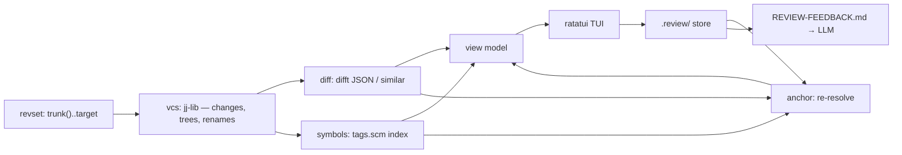

# rv — jj-native branch reviewer

**Status:** design approved, not yet implemented
**Date:** 2026-08-17

## 1. Purpose

`rv` reviews an entire jj bookmark or change stack in the terminal, lets you attach
inline comments to specific lines or syntax nodes, and persists them to an
uncommitted `.review/` directory whose markdown is fed directly to an LLM. The LLM
fixes the code and replies in the same file; you verify each reply in the TUI and
accept or reopen it.

The loop it closes:

```
rv (comment) → .review/REVIEW-FEEDBACK.md → LLM fixes + replies → rv (verify) → …
```

## 2. Constraints

1. **Git-provider independent.** No GitHub, no GitLab, no API, no network, no auth.
   Must work on a stack that has never been pushed anywhere — the common jj case.
2. **jj native.** jj is the only VCS `rv` speaks. Git repositories are supported
   *because git is a jj backend*: `jj git init --colocate` is the on-ramp, and jj
   assigns change ids to imported commits. There is no git code path.
3. **Change ids are the foundation.** A review is a long-lived claim about a change
   that will be rewritten. jj change ids are assigned once and survive every
   amend, rebase, and squash; git SHAs are content hashes and do not. This property
   is why the tool is jj-native rather than VCS-agnostic.
4. **Self-hostable.** `rv` must review `rv`'s own stack from the first usable
   milestone onward. Dogfooding is a requirement, not an aspiration.
5. **The LLM handoff is a file, not an integration.** `rv` never calls a model.
6. **Zero dependence on user configuration.** `rv` behaves identically on a raw,
   out-of-the-box jj installation and on a heavily customised one. It never reads
   the user's `revset-aliases`, command aliases, `ui.diff.tool`, or any other jj
   config. Every revset `rv` evaluates by default is self-contained, and the alias
   table it evaluates user-supplied revsets against is its own built-in copy of
   vanilla jj's defaults.

## 3. Non-goals

- Posting comments to any forge, or reading MRs/PRs.
- A git backend, a `Backend` trait, or any VCS abstraction layer. There will never
  be a second implementation, so the abstraction is dead weight.
- Multi-user or shared review state. `.review/` is local and uncommitted.
- Reimplementing difftastic's structural diff alignment.
- Mutating history. `rv` reads the repo and writes only `.review/` and
  `.git/info/exclude`.
- Full-text search as a user-facing feature. Grep is internal, serving reference
  lookup only.
- Reading the user's jj configuration for any purpose. A user's custom revset
  aliases will not resolve in `rv`, deliberately: behaviour must be reproducible
  across machines.
- A config file. v1 is CLI flags plus the `RV_NO_DIFFT` escape hatch.

## 4. Verified environment facts

Established by direct inspection on 2026-08-17, not assumed:

| Fact | Consequence |
|---|---|
| jj 0.44.0, Difftastic 0.70.0, `delta`, `rg`, `fzf`, `bat`, `cargo` present | Rust plus in-process jj-lib is viable |
| `nvim` and `tmux` **absent** from PATH | No editor-plugin path; the TUI must be self-contained |
| `jj-lib` 0.44.0 published 2026-08-06, MSRV 1.89, version-matched to the installed jj | In-process repo access; modules include `revset`, `repo`, `workspace`, `merged_tree`, `copies`, `id_prefix`, `op_walk`, `annotate` |
| `trunk()` is **not** in the user's config; `jj config list --include-defaults` shows it, so it is a jj-cli default embedded in the CLI | **jj-lib does not provide it.** `rv` ships its own built-in copy of vanilla jj's alias table; it never reads user config to obtain one |
| The real `trunk()` chain is `latest(main@origin \| master@origin \| trunk@origin \| …upstream… \| root())` | Always resolves, degrading to `root()`. No remote required; no fallback cascade needed. Only an *empty* range needs handling |
| difft JSON requires `DFT_UNSTABLE=yes`, else exit 2 with *"format may change in future"* | Unstable dependency; needs a version check and a fallback |
| difft `--exit-code`: **0 = no semantic change, 1 = changed** | Read the `status` field (`"changed"`/`"unchanged"`) instead; do not trust exit codes |
| difft JSON gives `aligned_lines` `[lhs, rhs]` plus `chunks[].lhs/rhs.changes[]` with byte offsets and a `highlight` kind | Free intra-line highlighting and both-side line numbers |
| An unknown file extension yields `language: "Text"` with valid JSON | The fallback path is needed only for binaries and JSON parse failures |
| `difft` takes file paths, not stdin | Blobs read in-process must still be written to a temp dir for difft |
| jj records renames natively (`renamed  b.rs -> c.rs`); jj-lib exposes this via `copies` | Rename detection needs no heuristics |
| `change_id.short()` is 12 chars; full change ids are 32 | Display truncates; storage keeps the full id |
| This repo is git (`main`, zero commits) and already jj-colocated; no remotes | No bootstrap step required |
| Grammar crates depend on `tree-sitter-language` ^0.1 as a normal dep; core `tree-sitter` is only a dev-dep | No ABI skew; one core version drives all grammars |
| `tree-sitter-tags` 0.26.12 is version-matched to `tree-sitter` 0.26 | Official symbol extraction via each grammar's bundled `tags.scm` |

Crate versions: `jj-lib` 0.44, `ratatui` 0.30, `crossterm` 0.29, `tui-textarea` 0.7,
`nucleo` 0.5, `tree-sitter` 0.26, `tree-sitter-tags` 0.26, `similar` 3.2,
`ignore` 0.4, `grep-searcher`, `blake3`, `serde`/`toml`, `clap`.

## 5. Architecture

Cargo workspace, two crates. `rv-core` never links ratatui or crossterm, so all
risky logic is testable without a terminal.

| Module (`rv-core`) | Owns | Knows nothing about |
|---|---|---|
| `vcs` | jj-lib access: workspace loading, config and revset-alias setup, revset evaluation, stack enumeration, tree and blob reads, rename detection | diffs, anchors, rendering |
| `diff` | `FileDiff` from difft JSON; `similar` fallback; `unchanged` suppression | symbols, review state |
| `symbols` | tree-sitter parsing, `NodePath` extraction via `tags.scm`, reference search, symbol timeline | diffs, review state |
| `anchor` | resolution cascade, confidence, lifecycle transitions, outdating | rendering, terminal |
| `store` | `.review/` I/O, markdown serde, snapshots, lock, exclude management | everything above except shared types |



### CLI surface (`rv` crate)

| Command | Behaviour |
|---|---|
| `rv [<bookmark>]` | Launch TUI. Range defaults to `trunk()..<bookmark or @>` |
| `rv --from <rev> --to <rev>` | Explicit range |
| `rv status [--json]` | Counts and one line per comment: id, state, file, resolved line, confidence |
| `rv render` | Rewrite `REVIEW-FEEDBACK.md` from current repo state, re-anchoring everything |
| `rv reanchor` | Re-resolve all anchors after a rebase or amend; report transitions |
| `rv symbol <name> [--json]` | Headless symbol timeline and reference count |

## 6. jj-lib integration

`vcs` loads the workspace with jj-lib and evaluates revsets in-process. Three
things must be handled explicitly — the first because it lives in jj-cli rather
than jj-lib, the others because jj-lib gives us more rope than the CLI does:

1. **Revset aliases.** `rv` ships a built-in table that is a verbatim copy of
   vanilla jj-cli's defaults — `trunk()`, `immutable_heads()`, `mutable()`,
   `visible()`, and the rest — and evaluates every revset against that table
   alone. User and repo config are never consulted, so `rv` resolves ranges
   identically on any machine. Defaults do not merely *reference* `trunk()`; the
   built-in expression is inlined, so the tool works even if the alias table were
   empty.
2. **Version compatibility.** `rv` links one jj-lib version while the user's `jj`
   binary moves independently. On workspace load failure, `rv` reports the linked
   jj-lib version alongside the on-disk format error and names the likely cause,
   rather than surfacing a raw error. CI tests against the pinned version; jj-lib
   upgrades are deliberate, reviewed changes.
3. **Working-copy snapshotting.** `rv` opens the workspace **read-only** and never
   triggers a working-copy snapshot itself, so running `rv` cannot alter the change
   under review.

### Range and stack resolution

`trunk()..target` always resolves, because the builtin `trunk()` degrades to
`root()`. An empty range is a hard error naming the resolved endpoints, never a
blank TUI. Stack enumeration is one revset evaluation in topological order.

Two views over the same range, toggled in the TUI:

- **Collapsed** (`1`): one diff from range base to head — the branch as a whole.
- **Stack** (`2`): one diff per change, in topological order.

No line-to-change attribution is computed between the views; each is an independent
diff, and a comment records which view and change it came from.

## 7. Diff pipeline

Blobs are read in-process from jj-lib merged trees, then written to a temp dir
because difft takes file paths, not stdin. Per file pair:

1. Run `DFT_UNSTABLE=yes difft --display json <old> <new>`.
2. On success, use `aligned_lines` for line pairing and `chunks[].changes[]` for
   intra-line highlight ranges. `status == "unchanged"` marks the file
   **suppressed** — reindentation and pure moves are not shown as diffs; they are
   reported collectively as "N files with no semantic change".
3. On non-zero exit, unparseable JSON, or a `difft --version` outside the tested
   range, fall back to a `similar` unified diff and label the file `fallback` in
   the UI. `RV_NO_DIFFT=1` forces this path.
4. Binary files produce a single "binary changed" block. They are not commentable
   by line; a file-scoped comment is still allowed.

Blobs load **lazily**, for the file being viewed, not for the whole range up front.
Diffs are recomputed per run; no cache, because review-sized diffs do not justify
one. Note that difft parses file content internally while `symbols` parses it
again for the node index — a deliberate double parse, negligible at review sizes,
which buys independence from difft's unstable JSON.

## 8. The node model (tree-sitter as the spine)

Everything structural derives from one primitive:

```rust
struct NodePath(Vec<NodeStep>);
struct NodeStep { kind: String, name: Option<String>, nth: u16 }
```

`nth` disambiguates unnamed or duplicate siblings, making the path total rather
than valid only for named symbols. `kind` is owned rather than `&'static str`
because paths round-trip through markdown.

| Feature | Derivation |
|---|---|
| Sidebar outline | file tree → collapsible `NodePath` tree, `nucleo`-filtered at any level |
| Changed-symbol summary | difft changed-line set → smallest enclosing named node → *"change 3 modified `Store::write`, deleted `Store::flush`"*. The primary structured context handed to the LLM |
| Anchor tier 1 | `NodePath` plus line offset within the node |
| Node-scoped comments | comment attaches to a node, needing no offset — the most robust anchor available |
| Reference jumping | identifier under cursor → `grep-searcher` candidates over an `ignore` walk → parse each hit file → keep only identifier-reference nodes, dropping comments and string literals → classify definition / call / import / type use |
| Symbol timeline | for each change, parse that revision's copy of the file and test whether the `NodePath` resolves → *"`flush` present at changes 1–3, absent from 4 onward; 0 remaining references in `@`"* |

The timeline is what proves a deletion is complete: node presence ignores mentions
in comments and unrelated same-name symbols, which occurrence counting cannot.
Reference results are capped at 200 hits, with truncation reported explicitly.

**v1 grammars:** Rust, TypeScript/TSX, Python, SQL, Nix, Go, Markdown, TOML, YAML,
Bash. Rust lands first, because dogfooding needs it first.

### Degradation matrix

| Situation | Outline | Anchors | Node comments | Timeline |
|---|---|---|---|---|
| Grammar available | node tree | node → content → line | yes | exact (node presence) |
| No grammar | difft hunk list | content → line | unavailable | `approximate` (occurrence count) |
| difft fallback active | `similar` hunk list | content → line | unavailable | as above |
| Binary | one block | file-scoped only | unavailable | unavailable |

Degraded state is labelled in both the TUI and the markdown. The tool never
presents a guess as a fact.

## 9. Anchor model

```rust
struct Pin { change_id: ChangeId, commit_id: CommitId, at: OffsetDateTime }

enum Scope {
    Line { offset_in_node: Option<u32> },
    Node,
    File,
}

struct Anchor {
    file: PathBuf,
    side: Side,                  // Right (added/context) or Left (deleted)
    scope: Scope,
    node: Option<NodePath>,
    line: u32,                   // as-of-pin; last-resort tier only
    content_hash: [u8; 32],      // blake3 of normalized line ± 3 context
    snapshot: SnapshotId,
    last_confidence: Confidence, // result of the most recent resolution, cached
}
```

**`change_id` is the identity; `commit_id` is advisory.** jj rewrites `@`'s commit
id on every working-copy snapshot, so using it to judge staleness would outdate
every comment on the working-copy change within seconds. `commit_id` is used only
to read the old blob while that commit still exists.

`content_hash` normalization: strip leading indentation, collapse internal
whitespace runs to a single space, trim trailing whitespace.

Snapshots are 10 lines (5 either side) stored verbatim at
`.review/snapshots/<id>`. They make verification independent of history rewriting:
`jj abandon` or a squash of the pinned commit cannot break the accept/reopen diff.

### Resolution cascade

Renames are followed first, via jj's native rename records, so a moved file does
not mass-outdate a review. **Side selects the tree to resolve against:** `Right`
anchors resolve against the range head, `Left` anchors (comments on deleted lines —
"you shouldn't have removed this") resolve against the range **base**, which is
stable while the base is. If the base moves, `Left` anchors re-resolve against the
new base through the same cascade.

Then, in order, each step falling through on failure:

1. **Node** — locate `NodePath` in the file's current tree; line = node start +
   offset; loosely confirm against `content_hash`. → `Exact`, or `Moved` if the
   line number changed.
2. **Content** — normalized scan of the file; multiple hits resolve to the one
   nearest the previous line. → `Moved`.
3. **Line** — raw line number, only if the file still exists. → `Weak`.
4. Otherwise → `Outdated`.

Confidence appears verbatim in the markdown, so neither you nor the LLM trusts a
`Weak` anchor blindly.

### Lifecycle

| State | Derived from | Rendering |
|---|---|---|
| `open` | anchor resolves, no reply | expanded, first |
| `awaiting-verification` | a `**Reply:**` block exists, anchor resolves | expanded |
| `resolved` | reply accepted by the human in the TUI | `<details>` collapsed |
| `outdated` | cascade returned `Outdated` | `<details>` collapsed, reason shown |

Only the human moves an entry to `resolved`. An LLM writing "Resolved" does not
resolve anything — it produces a reply, which is a request for verification. This
is deliberate: an agent grading its own homework is how bad fixes land.

## 10. Storage format

`.review/` at repo root, added to `.git/info/exclude` on first run — never the
tracked `.gitignore`, which is shared. **This is correctness, not hygiene:** jj
snapshots the worktree on every jj command, so an unexcluded `.review/` would make
the change under review mutate as you review it.

```
.review/
  REVIEW-FEEDBACK.md    round-trip surface
  session.toml          tool-owned scope: revset, base, head, change ids, started_at
  snapshots/<id>        verbatim excerpts
  .lock                 flock; single writer
```

Ownership is disjoint, which removes desync risk: `rv` writes entries and anchors;
the **LLM only ever appends `**Reply:**` blocks**; you write comments through the
TUI. Writes are **write-through on every comment**, never save-on-quit — a crash
mid-review must not cost comments. A panic hook restores the terminal before the
default hook runs.

Sections are the state machine, ordered `Open`, `Awaiting verification`,
`Resolved`, `Outdated`; within a section, ordered by change index, then path, then
line. `id` is a 4-hex prefix of blake3 over
`(change_id, file, node, line, timestamp)` and is the stable identity; the
displayed number is presentational.

`````markdown
<!-- rv:v1 -->
# Review: `symbol-anchors` — 6 changes, 14 files
Base `root()` → head `@ zkqrsuvw` · rv 0.1.0 · 2026-08-17T14:02Z

> **For LLMs:** fix each open comment, then append a `**Reply:**` block directly
> beneath it. Do not edit `<!-- rv: -->` markers, headings, or section order.
> Do not edit `<!-- rv: -->` markers, headings, or section order, and do not
> write a state into this file — `rv` resolves and abandons, and records who did.

**Amended by `2026-08-17-rv-storage-model-design.md` §3.** This block used to end
`Do not mark anything resolved — the human verifies in the TUI`, on the grounds
that an agent grading its own homework is how bad fixes land. The ban was
unenforceable and only moved the act out of sight; the storage model records
**who** settled a comment and shows it, which keeps the safe half of the rule.
The export is still out of the lifecycle: `session.toml` is the authority, and a
state written here would be overwritten by the next render.

## Open (3)

### 1. `rv-core/src/anchor.rs` · `impl Anchor > fn resolve` +3
<!-- rv:anchor id=7f3a change=zkqrsuvw commit=a91c40de side=right
     node="impl Anchor>fn resolve" offset=3 line=128 hash=9e21ab.. confidence=exact -->

```rust
127 |         if let Some(hit) = idx.find(sym) {
128 >|             return Resolution::exact(hit.start + self.offset.unwrap());
129 |         }
```

**Comment:** `unwrap()` panics for node-scoped comments, which have no offset by
construction. Should be `unwrap_or(0)`.

## Awaiting verification (2)

### 4. `rv/src/app.rs` · `fn handle_key`
<!-- rv:anchor id=2b81 … confidence=moved -->
**Comment:** terminal isn't restored if the render loop panics.
**Reply:** Added a panic hook calling `restore()` before the default hook.

## Resolved (4)

<details><summary>✅ 2. <code>rv-core/src/store.rs</code> · <code>fn write</code> — write-through, not save-on-quit</summary>

… anchor, comment, reply, verification timestamp …
</details>

## Outdated (1)

<details><summary>⚠️ 5. <code>rv-core/src/diff.rs</code> — anchor lost: node <code>fn merge</code> no longer exists</summary>

… original comment and snapshot preserved verbatim …
</details>
`````

The parser tolerates hand edits and LLM mangling: unknown prose is preserved,
malformed reply blocks are reported rather than dropped, and a missing or corrupt
`rv:anchor` marker moves that entry to `Outdated` with its text intact. Nothing a
model can write to this file causes comment loss.

## 11. TUI

Four surfaces:

- **Sidebar** — three-level outline (change → file → node), `nucleo`-filtered at
  any level; `1`/`2` switch collapsed vs stack view.
- **Diff pane** — difft-aligned, intra-line change ranges highlighted, comment
  markers in the gutter.
- **Comment buffer** — `tui-textarea`; `c` line-scoped, `C` node-scoped,
  `F` file-scoped.
- **Timeline pane** — `gr` on a symbol: per-change presence plus remaining
  reference count in `@`.

Keymap: `j`/`k` line, `J`/`K` hunk, `]`/`[` file, `1`/`2` view, `Tab` focus,
`/` filter, `gd` definition, `gr` references and timeline, `c`/`C`/`F` comment,
`a` accept, `r` reopen, `o` open in `$EDITOR`, `?` help, `q` quit.

On launch, if any entry is `awaiting-verification`, `rv` opens on those first, each
showing the stored snapshot diffed against the region as it is now — the LLM's
actual response to your comment — then `a` accepts or `r` reopens with a follow-up.

## 12. Testing

`rv-core` is terminal-free, so the risky logic is directly testable. Fixture repos
are built through jj-lib rather than by shelling out, which keeps the suite fast.

- **Anchor cascade:** fixture repos with real jj rewrites — `squash`, `rebase`,
  reformat-only edit, rename, node deletion, file deletion — asserting resolved
  line and confidence for each. The primary correctness suite.
- **Working-copy pinning:** assert a comment on `@` survives repeated working-copy
  snapshots (the `commit_id`-is-advisory rule).
- **Deleted-line anchors:** assert `Left`-side anchors resolve against base and
  stay `Exact` across head rewrites.
- **Markdown round-trip:** golden tests including hand-edited, reordered, and
  LLM-mangled input; assert no comment is ever lost.
- **Diff pipeline:** difft JSON parsing against captured fixtures;
  `status: unchanged` suppression; forced-fallback equivalence.
- **Symbols:** `NodePath` totality on duplicate siblings; reference classification
  excluding comment and string hits; timeline across a deletion.
- **jj-lib compatibility:** assert a clear, actionable error when the on-disk
  format is newer than the linked jj-lib.
- **TUI:** smoke tests via ratatui `TestBackend`.

## 13. Risks

| Risk | Mitigation |
|---|---|
| jj-lib is `0.x`, released in lockstep with jj-cli; upgrades may break the build, and the linked version can drift from the user's `jj` binary | Pin deliberately; actionable error on format mismatch naming both versions; `vcs` is the only module touching jj-lib, so the blast radius of an upgrade is one file |
| jj-cli defaults such as `trunk()` are absent from jj-lib | `rv` ships its own alias defaults, layered under user and repo config |
| difft JSON is explicitly unstable | Version check at startup, schema-tolerant parse, `similar` fallback always present, `RV_NO_DIFFT=1` escape hatch |
| Anchor cascade silently mis-resolves | Confidence surfaced in UI and markdown; snapshots always retained; fixture suite covers each rewrite kind |
| `.review/` accidentally committed or left unexcluded | Exclude written on first run and verified every run; `rv status` warns if tracked |
| tree-sitter grammar breadth becomes a maintenance tax | Degradation is specified and labelled; grammars are additive one-liners |
| Scope creep into a forge client | Non-goals are explicit; no network dependency is ever added |

## 14. Implementation order (dogfooding-driven)

Milestone 1 is the point `rv` can review itself; everything after is built under
its own review.

1. **Self-hosting minimum** — jj-lib workspace load with the alias defaults, range
   and stack enumeration, lazy blob reads, difft pipeline with `similar` fallback,
   collapsed view, line-scoped comments, `.review/` write-through with
   content-hash and line anchors, `rv render`. No tree-sitter yet.
2. **The loop closes** — reply parsing, `awaiting-verification` state, TUI
   verification flow against snapshots, accept and reopen, `rv reanchor`,
   `rv status --json`.
3. **Symbol spine** — tree-sitter with the Rust grammar: node-tier anchors,
   outline sidebar, `nucleo` picker, changed-symbol summaries, node-scoped
   comments.
4. **References and timeline** — reference search, classification, symbol
   timeline, `rv symbol`.
5. **Breadth** — remaining grammars, stack-view polish.

---

## Implementation status (audited 2026-08-19)

Milestones 1–2 and most of 3 have shipped; the tenses above are historical.
Where the code deliberately went another way, the later ruling wins:

- **§6/§11 `1`/`2` views** — the two views shipped as sidebar *tabs*
  (viewport spec §7): `Tab` cycles them, and `1`/`2`/`3` jump straight to the
  Files / Commits / Comments tab. Focus moves with `←`/`→` (`h`/`l`), not
  `Tab`.
- **§11 `a` accept / `r` reopen** — superseded by storage spec §3: `r` is
  resolve/reopen, `a` abandon/reopen, each recording who.
- **§11 `o` open in `$EDITOR`** — `o` was reassigned to file-list ordering
  (viewport §7); an editor key is unassigned, **open**.
- **§5/§10 `snapshots/` and `.review/.lock`** — snapshots were removed as a
  copy nothing read (storage §11); the lock was never built, and the
  single-writer story is the store's atomic whole-file rewrites, **open** as a
  ruling to make explicit if concurrent writers ever matter.
- **§2.5/§10 markdown round trip** — superseded whole by the 2026-08-19
  CLI-loop amendment: `rv comments --json` / `rv reply` are the loop, the
  markdown is a view.
- **§9 anchor cascade** — the `Weak` line tier and rename-following on
  re-anchor shipped 2026-08-19; confidence and the resolved line are surfaced
  through `rv comments --json` (`confidence`, `resolved_line`) rather than
  through markdown markers, per the CLI-loop amendment. The TUI does not yet
  show confidence: **open**.
- **Still open, unassigned to a milestone:** file-scoped comments (§9
  `Scope::File`, and with them commenting on binary files, §7.4); `J`/`K`
  hunk navigation (§11); a `difft --version` probe (§7.3 — the JSON-parse
  fallback covers malformed output, not a silently incompatible schema); an
  "N files with no semantic change" collective note (§7.2); an `rv status`
  warning when `.review/` is tracked (§13).
